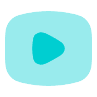
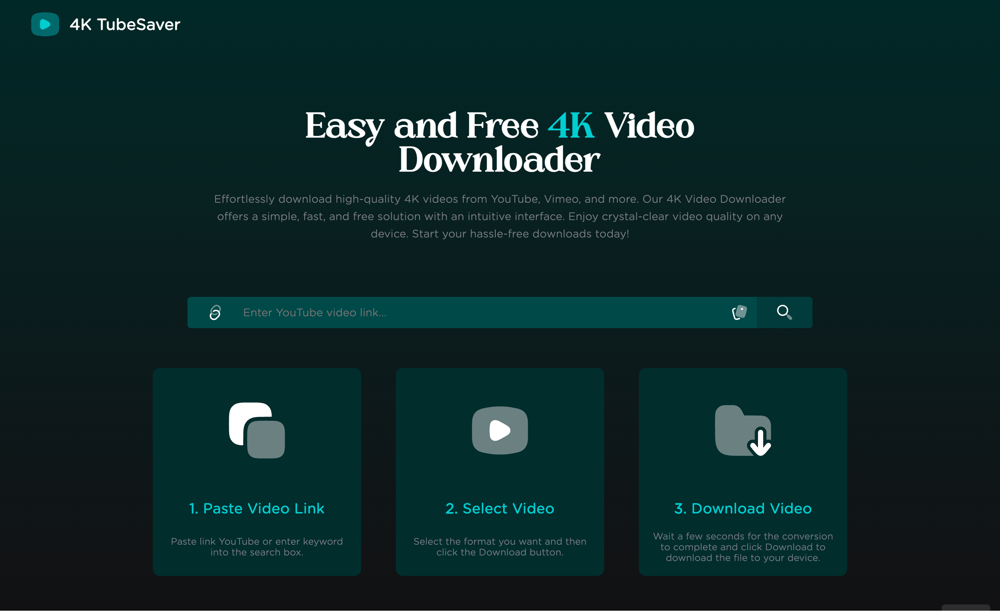
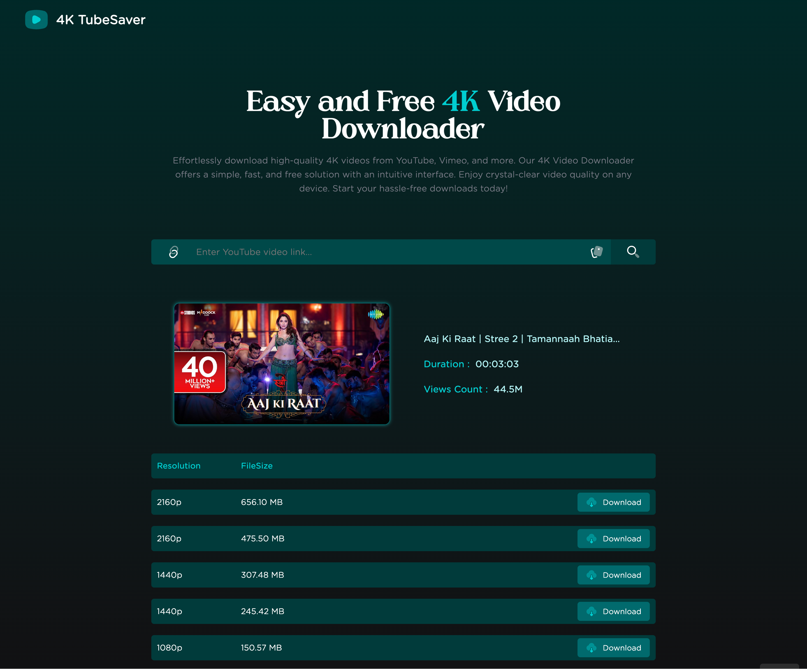
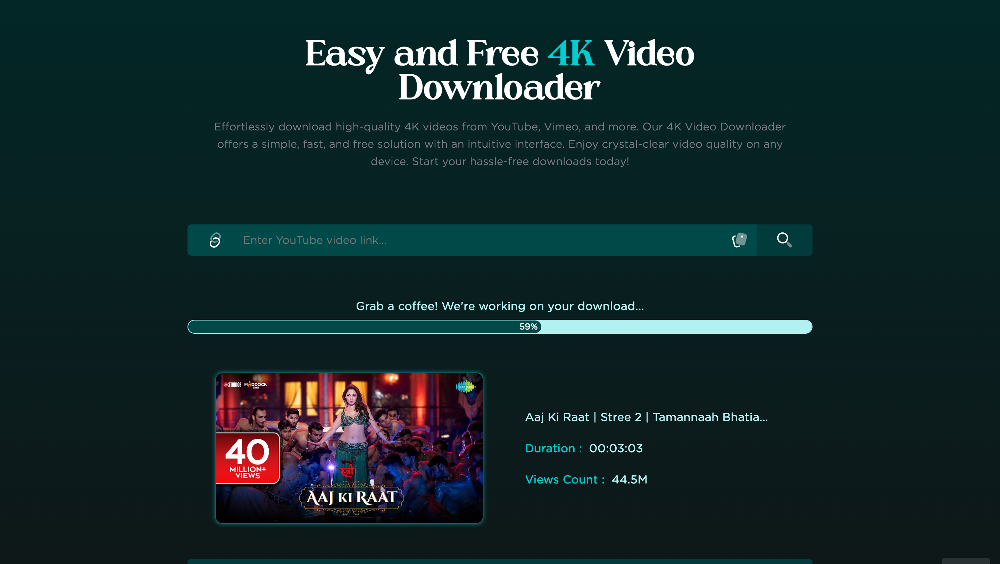

    
    <h1 style="font-size: 2.5em; margin: 20px 0;">4K TubeSaver</h1>
    
Welcome to 4K TubeSaver 
 
  
 Your ultimate solution for enjoying YouTube videos offline with the highest resolution and unparalleled clarity. Whether you're traveling, have limited internet access, or simply want to save your favorite content, our tool ensures you experience the best quality possible without any compromises.

    
    
    
    

## Features 🚀
<ul style="list-style-type: none; padding: 0; text-align: center;">
    <li style="font-size: 1.1em; margin-bottom: 10px;">✅ Incredible Download Speeds</li>
    <li style="font-size: 1.1em; margin-bottom: 10px;">✅ All Quality Options</li>
    <li style="font-size: 1.1em; margin-bottom: 10px;">✅ Separate Audio and Video Downloads</li>
    <li style="font-size: 1.1em; margin-bottom: 10px;">✅ Optimized for Size: Super Fast and Efficient</li>
    <li style="font-size: 1.1em; margin-bottom: 10px;">✅ Crystal Clear Picture Quality with No Frame Drops</li>
</ul>

## Website Link 🔗

    <a href="https://jenidownloader.vercel.app/" target="_blank" style="text-decoration: none; padding: 15px 30px; background-color: #4CAF50; color: #fff; border-radius: 8px; font-weight: bold; display: inline-block; margin-top: 20px; font-size: 1.2em;">Visit the 4K Youtube Downloader</a>

## Disclaimer ℹ️

    This project and its contents are not affiliated with, funded, authorized, endorsed by, or in any way associated with YouTube, Google LLC, or any of its affiliates and subsidiaries. 
    Any trademark, service mark, trade name, or other intellectual property rights used in this project are owned by the respective owners.

